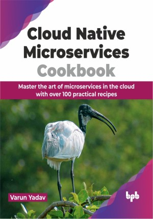

# Cloud Native Microservices Cookbook

Unlock the secrets of cloud-native success with step-by-step recipes for conquering every stage of microservice deployment

This is the repository for [Cloud Native Microservices Cookbook
](https://bpbonline.com/products/cloud-native-microservices-cookbook?variant=43496591425736),published by BPB Publications.

## About the Book
The convergence of microservices and cloud technology represents a significant paradigm shift in software development. To fully leverage the potential of both, integration from the outset of application development is crucial. Cloud-native microservices cookbook serve as a conduit, harmonizing disparate elements of microservice construction by establishing a cohesive framework from inception to deployment.

This book meticulously outlines the various stages involved in launching an application utilizing cloud-native microservices. It commences with the foundational aspects of application development, emphasizing microservice architecture principles such as configuration and service discovery, considering cloud infrastructure. Progressing through containerization, continuous integration (CI), and continuous deployment (CD) pipelines, the book explores the intricacies of orchestration, high availability (HA), auto scalability, and cloud security. Subsequently, it elucidates the significance of observability in monitoring microservices post-deployment, concluding with a comprehensive exploration of Infrastructure as Code (IaC) for cloud infrastructure provisioning.

Explore cloud-native microservices basics using real-world examples from the finance sector. Follow curated recipes from concept to cloud deployment for a clear understanding and smooth application development.

## What You Will Learn
• Practical methodology encompassing the development, testing, building, containerization, and orchestration of microservices.

• Software development, spanning from initial design to cloud hosting.

• Achieve microservice auto scalability and high availability.

• Utilizing cloud services and experimenting with newfound services confidently.

• Meticulously track cloud expenditures, alleviating any apprehension surrounding cost management. 
